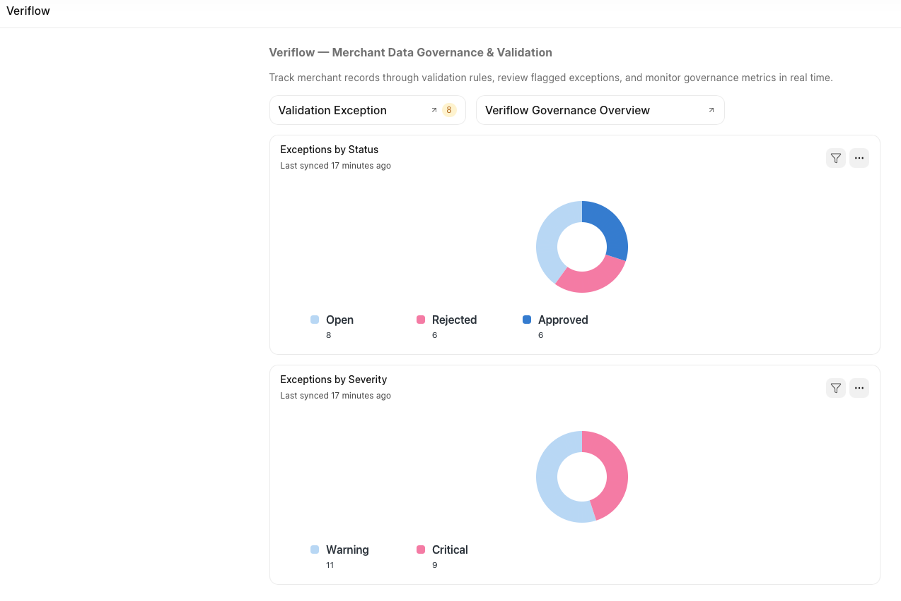
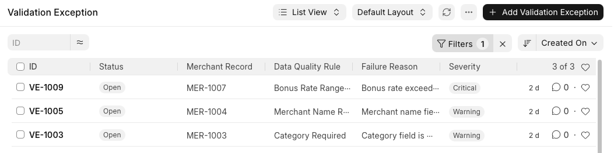
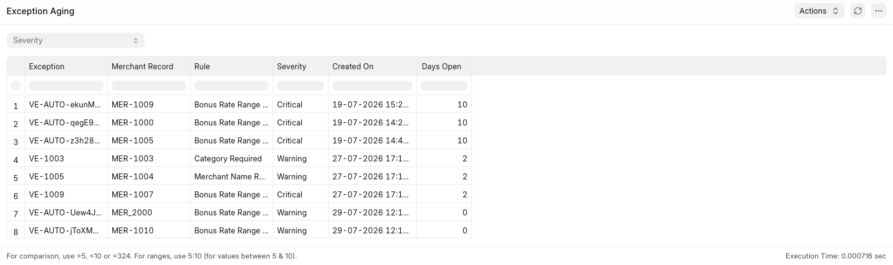

# Veriflow

**A data governance and validation workflow app built on Frappe.**

Veriflow simulates real-world merchant data governance: records flow
through configurable validation rules, rule violations are tracked as
reviewable exceptions, and every reviewer decision is automatically
logged in a tamper-resistant audit trail — no manual step required.

Built as a portfolio project to demonstrate practical Frappe Framework
development: custom DocTypes, server-side automation, role-gated
workflows, reporting, dashboards, and API design.

---

## Why this project

Most Frappe tutorials build inventory/CRM clones. Veriflow instead
models a real governance problem — the kind of merchant data validation
and bonusing oversight work found in analyst roles at companies like
American Express — with a data model, automation, and reporting to match.

---

## Screenshots

**Workspace home** — live governance metrics at a glance


**Validation Exception queue** — filtered to Open, the reviewer's work list


**Exception Aging report** — backlog sorted oldest-first, with severity filter


---

## Architecture

**Data model** (dependency order):

```
Merchant Category ← Merchant Record
                          ↑
Data Quality Rule ← Validation Exception → Audit Log
```

- **Merchant Category** / **Merchant Record** — the governed data.
  Category is a proper relational Link, not free text.
- **Data Quality Rule** — org-defined rules (range checks, required
  fields, allowed-value lists), each with a severity.
- **Validation Exception** — a single rule violation on a single
  Merchant Record. Links back to both the record and the rule that
  failed it.
- **Audit Log** — an automatically-populated, read-only trail of every
  status change on every exception. Never manually editable.
- **Veriflow Settings** — a Single DocType for global configuration
  (default severity, aging threshold, escalation contact).

**Workflow:** Validation Exception moves through `Open → Approved /
Rejected`, with `Reopen` paths back to `Open`. All transitions are
gated to a custom `Data Governance Reviewer` role — verified by testing
as a non-admin user, not just assumed from the admin view.

**Automation:** a server-side hook (`veriflow/audit.py`, registered in
`hooks.py`) fires on every Validation Exception save, checks whether
`status` actually changed, and — if so — automatically creates the
matching Audit Log entry with before/after status, who made the
change, and when.

**Reporting:** a Script Report (`Exception Aging`) surfaces the current
backlog of unreviewed exceptions, oldest-first, using parameterized SQL
with a computed `DATEDIFF`-based aging column and a severity filter.

**Dashboard:** live Number Cards (Open Exceptions, Critical Open
Exceptions) and Dashboard Charts (by Status, by Severity), embedded
directly on the app's Workspace home page.

**API:** a whitelisted method (`get_exception_summary()`) exposes
aggregate exception stats, callable via `frappe.call()` or a direct
REST-style URL — powers an interactive summary dialog triggered from a
custom form button.

---

## Tech stack

- Frappe Framework (Python backend, JS frontend, MariaDB, Redis)
- Custom app: `veriflow`
- No frontend framework beyond Frappe's own Desk UI + client scripting

---

## Features by curriculum concept

| Concept | Where it lives |
|---|---|
| Custom DocTypes | `veriflow/veriflow/doctype/` |
| Server-side hooks (`doc_events`) | `veriflow/audit.py`, `hooks.py` |
| Client scripting | Client Scripts (fixtures) |
| Whitelisted API | `veriflow/api.py` |
| Role-based permissions | Verified with a dedicated non-admin test user |
| Workflow (state machine) | Fixtures — `Validation Exception Review` |
| Script Report | `veriflow/veriflow/report/exception_aging/` |
| Dashboard / Number Cards / Charts | Fixtures |
| Custom Field / Property Setter | Fixtures — extends core `Contact` DocType |
| Single DocType | `Veriflow Settings` |

---

## Setup

```bash
bench get-app veriflow https://github.com/rakshitsharma0402/Veriflow.git
bench --site yoursite.localhost install-app veriflow
```

Installing the app automatically imports the fixtures (Workflow,
Client Scripts, Dashboard, Role, etc.) via Frappe's standard fixture
mechanism.

---

## Known limitations

- **Rule engine:** an hourly scheduled job (`scheduler_events` in `hooks.py`) automatically evaluates every active Data Quality Rule against every Merchant Record, creating a Validation Exception for any failure — with duplicate protection so the same violation isn't re-flagged on every run. This closes the loop: data comes in, gets checked automatically, surfaces as a reviewable exception, gets decided on, and the decision is logged automatically.
- Two of the four seed Data Quality Rules ("Merchant Name Required,"
  "Category Required") duplicate constraints already enforced as
  mandatory fields on Merchant Record — they'd only become meaningful
  against data entering through a path that bypasses form validation
  (e.g. a bulk import script).
- Single-user tested; no automated test suite yet.

---

## What I'd build next

- Auto-escalation using `Veriflow Settings`' aging threshold
- Print Format for compliance-style exception export
