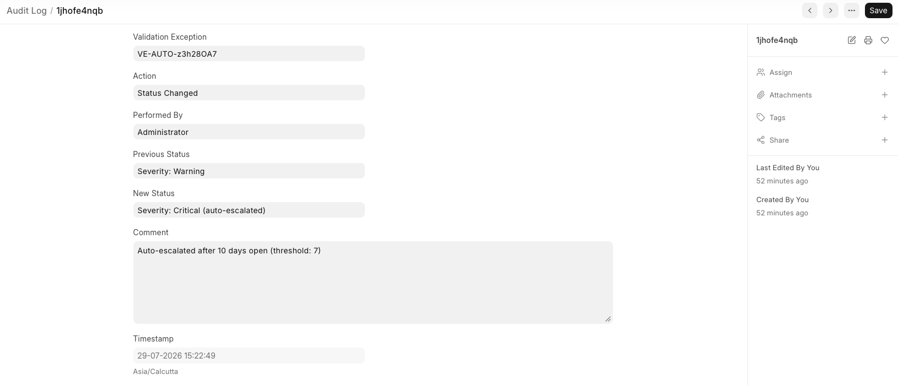
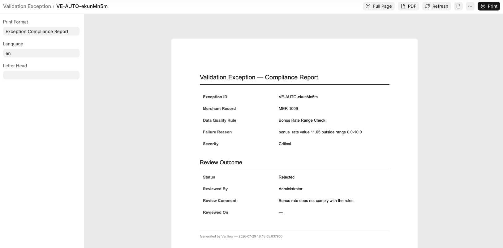

# Veriflow

**A data governance and validation workflow app built on Frappe.**

Veriflow simulates real-world merchant data governance: records are
automatically checked against configurable validation rules, rule
violations are tracked as reviewable exceptions, aged exceptions are
auto-escalated, and every reviewer decision is automatically logged in
a tamper-resistant audit trail — no manual step required anywhere in
the pipeline.

Built as a portfolio project to demonstrate practical Frappe Framework
development: custom DocTypes, server-side automation, scheduled jobs,
role-gated workflows, reporting, dashboards, API design, and
compliance-style document export.

---

## Why this project

Most Frappe tutorials build inventory/CRM clones. Veriflow instead
models a real governance problem — the kind of merchant data validation
and bonusing oversight work found in analyst roles at companies like
American Express — with a data model, automation, and reporting to match.

---

## Screenshots

**Workspace home** — live governance metrics at a glance


**Validation Exception queue** — filtered to Open, the reviewer's work list


**Exception Aging report** — backlog sorted oldest-first, with severity filter


**Audit Log entry** — an auto-escalation event, fully explained


**Compliance Report** — printable/PDF export of a reviewed exception


---

## Architecture

**Data model** (dependency order):

```
Merchant Category ← Merchant Record
                          ↑
Data Quality Rule ← Validation Exception → Audit Log
```

- **Merchant Category** / **Merchant Record** — the governed data.
  Category is a proper relational Link, not free text.
- **Data Quality Rule** — org-defined rules (range checks, required
  fields, allowed-value lists), each with a severity.
- **Validation Exception** — a single rule violation on a single
  Merchant Record. Links back to both the record and the rule that
  failed it.
- **Audit Log** — an automatically-populated, read-only trail of every
  status change and system action on every exception. Never manually
  editable.
- **Veriflow Settings** — a Single DocType for global configuration
  (default severity, aging threshold, escalation contact).

**Rule engine (automated):** an hourly scheduled job
(`scheduler_events` in `hooks.py`) evaluates every active Data Quality
Rule against every Merchant Record, automatically creating a
Validation Exception for any failure — with duplicate protection so
the same violation isn't re-flagged on every run. A manual "Run Rule
Engine" button on the Merchant Record list view triggers the same
check on demand.

**Auto-escalation:** a daily scheduled job reads the aging threshold
from Veriflow Settings, finds Open exceptions that have exceeded it,
escalates their severity to Critical, logs the escalation as an Audit
Log entry explaining why, and attempts to email the configured
governance contact (wrapped in a try/except so a missing outgoing
email account — expected in local dev — doesn't crash the escalation).

**Workflow:** Validation Exception moves through `Open → Approved /
Rejected`, with `Reopen` paths back to `Open`. All transitions are
gated to a custom `Data Governance Reviewer` role — verified by testing
as a non-admin user, not just assumed from the admin view.

**Automation:** a server-side hook (`veriflow/audit.py`, registered in
`hooks.py`) fires on every Validation Exception save, checks whether
`status` actually changed, and — if so — automatically creates the
matching Audit Log entry with before/after status, who made the
change, and when.

**Reporting:** a Script Report (`Exception Aging`) surfaces the current
backlog of unreviewed exceptions, oldest-first, using parameterized SQL
with a computed `DATEDIFF`-based aging column and a severity filter.

**Dashboard:** live Number Cards (Open Exceptions, Critical Open
Exceptions) and Dashboard Charts (by Status, by Severity), embedded
directly on the app's Workspace home page.

**API:** a whitelisted method (`get_exception_summary()`) exposes
aggregate exception stats, callable via `frappe.call()` or a direct
REST-style URL — powers an interactive summary dialog triggered from a
custom form button. The rule engine itself is also whitelisted, powering
the on-demand "Run Rule Engine" button.

**Compliance export:** a custom Jinja Print Format ("Exception
Compliance Report") renders a clean, printable/PDF record of any
Validation Exception — merchant details, the rule violated, and the
full review outcome — suitable for attaching to a compliance file. Set
as the default print format for the DocType.

---

## Tech stack

- Frappe Framework (Python backend, JS frontend, MariaDB, Redis)
- Custom app: `veriflow`
- No frontend framework beyond Frappe's own Desk UI + client scripting

---

## Features by curriculum concept

| Concept | Where it lives |
|---|---|
| Custom DocTypes | `veriflow/veriflow/doctype/` |
| Server-side hooks (`doc_events`) | `veriflow/audit.py`, `hooks.py` |
| Scheduled jobs (`scheduler_events`) | `veriflow/rule_engine.py`, `hooks.py` |
| Client scripting | Client Scripts (fixtures) |
| Whitelisted API | `veriflow/api.py`, `veriflow/rule_engine.py` |
| Role-based permissions | Verified with a dedicated non-admin test user |
| Workflow (state machine) | Fixtures — `Validation Exception Review` |
| Script Report | `veriflow/veriflow/report/exception_aging/` |
| Dashboard / Number Cards / Charts | Fixtures |
| Custom Field / Property Setter | Fixtures — extends core `Contact` DocType |
| Print Format (Jinja) | Fixtures — `Exception Compliance Report` |
| Single DocType | `Veriflow Settings` |
| Fixtures | `veriflow/fixtures/` |

---

## Setup

```bash
bench get-app veriflow https://github.com/rakshitsharma0402/Veriflow.git
bench --site yoursite.localhost install-app veriflow
```

Installing the app automatically imports the fixtures (Workflow,
Client Scripts, Dashboard, Role, Print Format, etc.) via Frappe's
standard fixture mechanism.

---

## Known limitations

- Two of the four seed Data Quality Rules ("Merchant Name Required,"
  "Category Required") duplicate constraints already enforced as
  mandatory fields on Merchant Record — they'd only become meaningful
  against data entering through a path that bypasses form validation
  (e.g. a bulk import script).
- Escalation emails are attempted but will fail gracefully in any
  environment without a configured outgoing Email Account (expected
  for local dev) — the failure is logged to Frappe's Error Log rather
  than sent, and does not block the escalation itself.
- Single-user tested; no automated test suite yet.

---

## What I'd build next

- Real outgoing email configuration (e.g. via a test SMTP provider)
  to demonstrate the full escalation notification path end-to-end
- A second, dedicated intake path (e.g. a bulk import script) that
  bypasses form-level validation, making the "required field" Data
  Quality Rules meaningful rather than redundant
- Automated test suite
